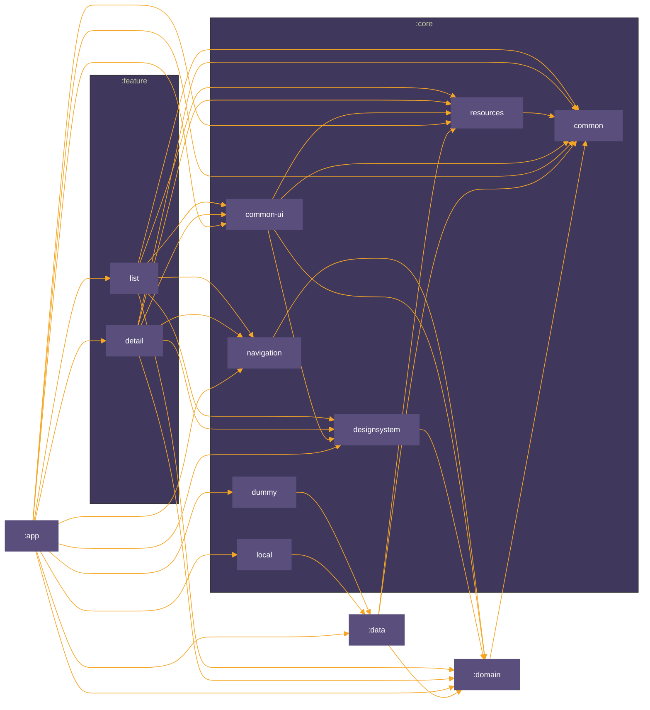

### Module Graph

```mermaid
%%{
  init: {
    'theme': 'base',
    'themeVariables': {"primaryTextColor":"#fff","primaryColor":"#5a4f7c","primaryBorderColor":"#5a4f7c","lineColor":"#f5a623","tertiaryColor":"#40375c","fontSize":"12px"}
  }
}%%

graph LR
  subgraph :core
    :core:navigation["navigation"]
    :core:dummy["dummy"]
    :core:local["local"]
    :core:common["common"]
    :core:common-ui["common-ui"]
    :core:designsystem["designsystem"]
    :core:resources["resources"]
  end
  subgraph :feature
    :feature:list["list"]
    :feature:detail["detail"]
  end
  :core:navigation --> :domain
  :core:dummy --> :data
  :core:local --> :data
  :feature:list --> :core:common
  :feature:list --> :core:common-ui
  :feature:list --> :core:navigation
  :feature:list --> :domain
  :feature:list --> :core:designsystem
  :feature:list --> :core:resources
  :feature:detail --> :core:common
  :feature:detail --> :core:common-ui
  :feature:detail --> :core:navigation
  :feature:detail --> :domain
  :feature:detail --> :core:designsystem
  :feature:detail --> :core:resources
  :core:resources --> :core:common
  :core:common-ui --> :core:designsystem
  :core:common-ui --> :domain
  :core:common-ui --> :core:common
  :core:common-ui --> :core:resources
  :app --> :data
  :app --> :domain
  :app --> :core:designsystem
  :app --> :core:common
  :app --> :core:common-ui
  :app --> :core:resources
  :app --> :core:navigation
  :app --> :core:local
  :app --> :core:dummy
  :app --> :feature:list
  :app --> :feature:detail
  :data --> :domain
  :data --> :core:common
  :data --> :core:resources
  :domain --> :core:common
  :core:designsystem --> :domain
```