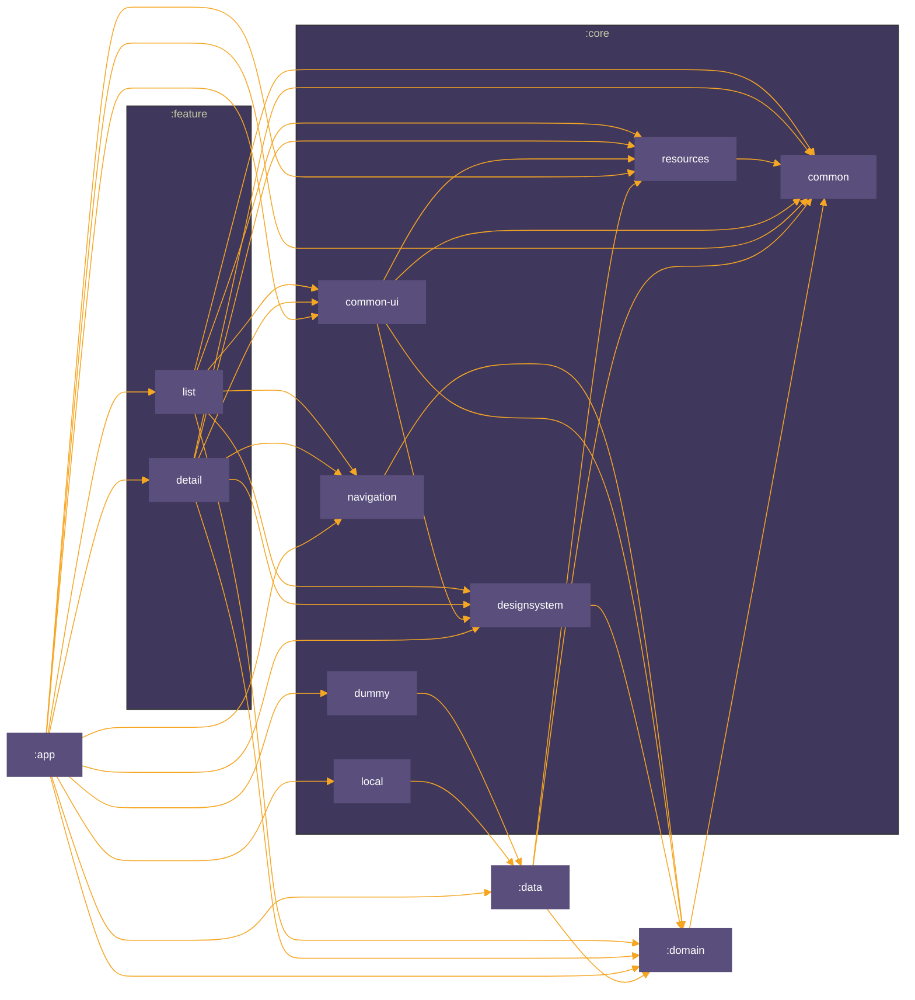

<h1 align="center">Satellites</h1>

<p align="center">
  <a href="https://opensource.org/licenses/Apache-2.0"></a>
  <a href="https://android-arsenal.com/api?level=24"></a>
  <a href="https://github.com/iamkurtgoz/satellitesapp/actions"></a> <br>
</p>

<p align="center">
🗡️ Satellites demonstrates modern Android development with Hilt, Coroutines, Flow, Jetpack (Room, ViewModel) and Compose based on MVI architecture.
</p>

<p align="center">
    
    
</p>


## Download
Go to the [Releases](https://github.com/iamkurtgoz/satellitesapp/releases) to download the latest APK.

## Tech stack & Open-source libraries
- Minimum SDK level 24.
- [Kotlin](https://kotlinlang.org/) based, utilizing [Coroutines](https://github.com/Kotlin/kotlinx.coroutines) + [Flow](https://kotlin.github.io/kotlinx.coroutines/kotlinx-coroutines-core/kotlinx.coroutines.flow/) for asynchronous operations.
- Jetpack Libraries:
    - Jetpack Compose: Android’s modern toolkit for declarative UI development.
    - Lifecycle: Observes Android lifecycles and manages UI states upon lifecycle changes.
    - ViewModel: Manages UI-related data and is lifecycle-aware, ensuring data survival through configuration changes.
    - Navigation: Facilitates screen navigation, complemented by [Hilt Navigation Compose](https://developer.android.com/jetpack/compose/libraries#hilt) for dependency injection.
    - Room: Constructs a database with an SQLite abstraction layer for seamless database access.
    - [Hilt](https://dagger.dev/hilt/): Facilitates dependency injection.
- Architecture:
    - MVI Architecture (Model - View - Intent): The MVI (Model-View-Intent) architecture treats user interactions or events as "Intents," which then lead to a state change observed by the "View." This approach centralizes all application state in one place, allowing for a single source of truth. MVI is particularly beneficial for managing complex user interactions, as it promotes consistent and understandable flows, improves testability, and simplifies debugging.
- [Gson](https://github.com/google/gson): Converts from json to object and from object to json.
- [Kotlin Serialization](https://github.com/Kotlin/kotlinx.serialization): Kotlin multiplatform / multi-format reflectionless serialization.
- [ksp](https://github.com/google/ksp): Kotlin Symbol Processing API for code generation and analysis.
- [Turbine](https://github.com/cashapp/turbine): A small testing library for kotlinx.coroutines Flow.

### Module Graph


## Find this repository useful? :heart:
Support it by joining __[stargazers](https://github.com/iamkurtgoz/satellitesapp/stargazers)__ for this repository. :star: <br>
Also, __[follow me](https://github.com/iamkurtgoz)__ on GitHub for my next creations! 🤩

# License
```xml
    Copyright 2024 Mehmet KURTGOZ

    Licensed under the Apache License, Version 2.0 (the "License");
    you may not use this file except in compliance with the License.
    You may obtain a copy of the License at

    http://www.apache.org/licenses/LICENSE-2.0

    Unless required by applicable law or agreed to in writing, software
    distributed under the License is distributed on an "AS IS" BASIS,
    WITHOUT WARRANTIES OR CONDITIONS OF ANY KIND, either express or implied.
    See the License for the specific language governing permissions and
    limitations under the License.
```
